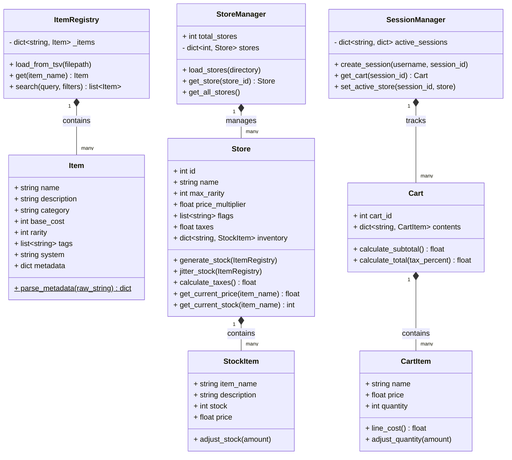

### Goal

Create a system where players at a tabletop RPG session can connect to a server hosted by the gamemaster to browse and purchase in-game items.  When the transaction is completed, the purchaser can trigger a thermal printer attached to the server that runs off a receipt that also includes relevant stats about the item in question.

The project consists of four files:
- items.tsv - Contains all items in a careful organization
- start_server.py - Kicks on uvicorn to run the server.py file along with the textual server for the client
- server.py - Main server file. This handles the importing of the library, the transaction logic, the API logic and the printer
- client.py - Contains a textual interface for searching through available items, making purchases, etc.
- /stores/(storename).toml files - These files are automatically searched for and parsed by the server to generate the various stores, their schema is described below

#### items.tsv Details
item_name	description	category	cost	rarity	tags	system	metadata

| Column      | Meaning                                                            |
| ----------- | ------------------------------------------------------------------ |
| item_name   | Name of item                                                       |
| description | Text description                                                   |
| category    | armor, weapon, consumable, utility, goods                          |
| cost        | integer cost in smallest unit                                      |
| rarity      | 0–6 (common, uncommon, rare, very rare, exotic, legendary, mythic) |
| tags        | comma‑separated generic tags                                       |
| system      | e.g. SWN, D&D5e, Alien RPG                                         |
| metadata    | semicolon‑separated key:value pairs                                |
metadata example:
```
dmg:1d6;range:50/75;uses:1;attr:dex;enc:2;license:1
```

### Server Details
1. Load all items into `AvailableItems`
2. Scan `/stores/` for `*.toml`
3. Parse each TOML into a `Store` object
4. Apply filters, rarity caps, and flags to determine availability
5. Expose FastAPI endpoints for:
    - `GET /stores`: List available shops
    - `GET /stores/{id}/inventory`: See merged stock and registry data
    - `GET /items`: Full item registry dump
    - `POST /start-session`: Initialize a user session
    - `POST /sessions/{sid}/store/{id}`: Set active store for a user
    - `POST /cart/add`: Add item to cart (deducts from store shelf)
    - `POST /cart/remove`: Remove from cart (restores to store shelf)
    - `POST /cart/cancel/{sid}`: Empty cart and restore all stock
    - `POST /checkout`: Finalize sale and optional thermal print

The server logic handles stock management, including "Use Boxes" calculation (1 box per 5 uses) for item stat blocks on receipts.

### Store Details
Store files are located in the `/stores/` directory. Note: `id` is assigned automatically by the `StoreManager` based on load order.

```toml
id = "storeid"
name = "name of store"
enabled = true (or false)
max_rarity = # (integer 0-6 based on max rarity allowed)
filter = "filters to scan through when processing, e.g. TL < 2 or license < 3 or encumberance < 2, etc.  Separate with a ;"
price_multiplier = # (float base price multipler)
store_flags = flags in a list that trigger specific behavior (see below) for that store in [ ]
```

##### Store Flags
```
unlimited_stock  - No stock depletion when buying
volatile_stock - Stock is regenerated every time a purchase is finalized
all_items_available - Every item possible is available to buy
variable_prices - Prices are randomly set (75-125% nominal)
free_items - All items in the store cost 0

low_tax - Apply a sales tax of 1%
med_tax - Apply a sales tax of 10%
high_tax - Apply a sales tax of 20%

```

### Client Behavior
### 1. **Connect**
- Connect to server
* Receive session ID
- Session tracks cart and prevents cross‑player interference
### 2. **Browse**
- List items available in the selected store
- Tap/click to add to cart
### 3. **Cart**
- Shows items, subtotal, tax, total
- Tap/click to remove items
- Optionally request printed receipt
- Checkout triggers:
    - stock updates
    - receipt generation
    - optional thermal print
### Client details
The client consists of a simple textual application that consists of a welcome TabPane that has a single button that engages the connection to the server (api call) and generates the necessary session id (from the python secrets). This session ID  is stored on the server and keeps track of things like their 'cart', etc. This provides a little security in case players want to take each others stuff.

On the second tab page there is a list of all available items, the stock, etc. If the player taps an item (or clicks it), it is added to the cart on the Third tab pane.  If a player taps or clicks an item in the cart, it removes it (through an appropriate API call).  Subtotal, tax amount and total are prominently displayed for the players records.  If the player is happy, they can click a radio button for a printout (from the thermal printer) or not and then hit checkout.  At checkout, the various api calls are made, store stock is modified and the player gets a small summary (and a piece of paper with stats on it if they pick the appropriate check box.)

```receipt
UNION DEPOT
SALES RECEIPT
01/01/1105 7:51:20 PM
---------------------
LASER RIFLE
1X  250.00   250.00
POWER CELL (A)
7x  30.00    210.00
--------------------
ITEMS SOLD: 8
SUBTOTAL:   460.00
TAXES:        4.60
TOTAL:      464.60

THANK YOU FOR SHOPPING	
WITH US


..................
1. Laser Rifle (1x)
1d10 Damage
2 enc
30 uses [][][][][][]
2. Power Cell Type A
1 enc
20 uses [][][][]
3. Power Cell Type A
1 enc
20 uses [][][][]
4. Power Cell Type A
1 enc
20 uses [][][][]
5. Power Cell Type A
1 enc
20 uses [][][][]
6. Power Cell Type A
1 enc
20 uses [][][][]
7. Power Cell Type A
1 enc
20 uses [][][][]
8. Power Cell Type A
1 enc
20 uses [][][][]
```

Example receipt above.  Each box is 5 uses.

### Classes 

